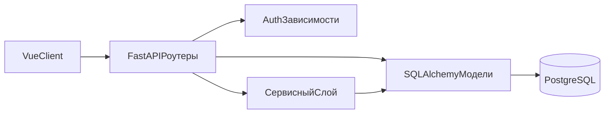

# Обзор архитектуры

HabitFlow реализован как **слоистый монолит**:

- HTTP/API-слой в роутерах FastAPI.
- Бизнес-логика в `app/services/*` (наиболее выражена в уведомлениях и календаре).
- Персистентность на SQLAlchemy ORM поверх PostgreSQL.

Это не строгая Clean/Hexagonal-архитектура, потому что роутеры по-прежнему содержат оркестрацию и прямую работу с сессией.

## Почему архитектура выглядит так

- Быстрая поставка MVP: прямой доступ роутера к ORM ускоряет разработку.
- По мере роста сложности появились сервисные модули для нетривиальных правил.
- Приоритет — операционная простота (один API-процесс + БД), а не максимальная абстракция.

## Границы модулей

## Архитектурные характеристики

- **Монолитная единица деплоя**: один backend-процесс обслуживает все API-задачи.
- **Общая доменная модель**: ORM-сущности переиспользуются в нескольких слоях.
- **Смешанная оркестрация**: логика распределена между роутерами и сервисами.
- **Гибридная архитектура напоминаний**: backend вычисляет due-уведомления, frontend показывает их через браузер.

## Ключевые риски

- Бизнес-логика в роутерах усиливает связность и повышает риск регрессий при изменении эндпоинтов.
- Сервисы worker/self-healing реализованы и покрыты тестами, но не развернуты отдельным процессом в compose.
- Стратегия миграций делает упор на синхронизацию схемы, а не на строгую безопасность rollback.

См. также:
- [Архитектурные решения](./decisions.md)
- [Обзор backend](../backend/overview.md)
- [Жизненный цикл запроса](../flows/request_lifecycle.md)
