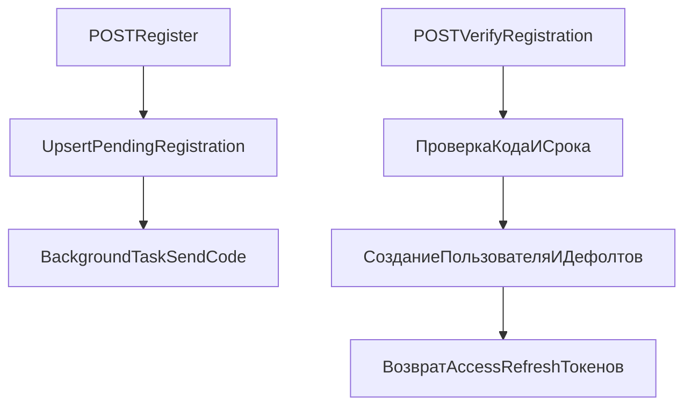
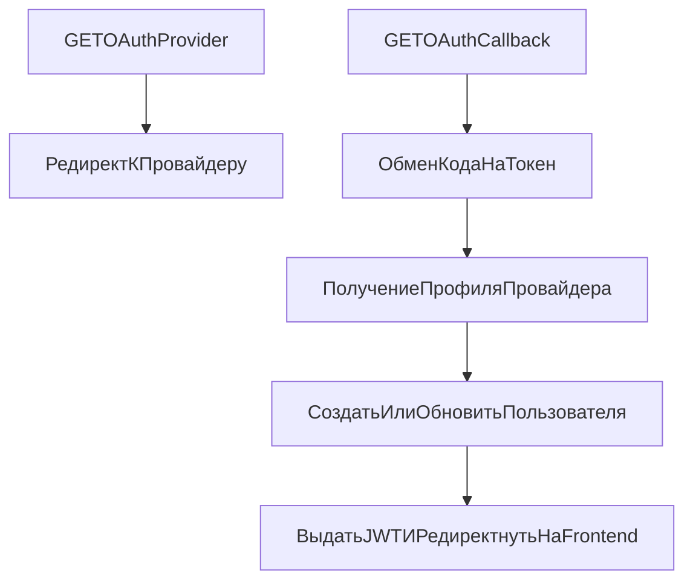

# Поток auth и OAuth

## Поток регистрации по email

### Примечания

- Регистрация не создает строку в `users`, пока код не подтвержден.
- Верификация создает пользователя + дефолтные настройки уведомлений + free-подписку.
- Выдача токенов происходит сразу после успешной верификации/логина.

## Поток OAuth (Yandex/VK)

### Примечания

- OAuth state подписывается JWT и валидируется в callback.
- OAuth-пользователь может существовать без локального `password_hash`.
- Callback редиректит frontend с access и refresh токенами в query-параметрах.

## Поток refresh-токена

- Frontend-interceptor один раз перехватывает 401.
- Вызывает `/api/v1/auth/refresh` с refresh-токеном.
- При успехе повторяет исходный запрос с новым access-токеном.
- При неудаче очищает локальное auth-состояние.

См. также:
- [Эндпоинты auth](../api/auth.md)
- [Жизненный цикл запроса](./request_lifecycle.md)
- [Конфигурация](../config/overview.md)
