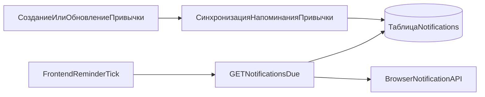

# Поток напоминаний

В HabitFlow напоминания формируются на сервере, но в основном доставляются на стороне клиента.

## Сквозной путь

## Подробные шаги

1. Создание/обновление привычки с `reminder_time` вызывает `sync_habit_notification`.
2. Сервис рассчитывает следующий `goal_datetime` по recurrence-правилу и таймзоне пользователя.
3. Строка уведомления создается/обновляется и помечается активной.
4. Frontend-composable опрашивает `/api/v1/notifications/due`.
5. Due-пейлоад дедуплицируется по `idempotency_key` и показывается через Browser Notification API.
6. Frontend также держит локальный fallback-путь проверки по времени привычки и дневным логам.

## Логика worker и self-healing

- `notification_worker.py` реализует обработку с lock-механизмом и переносом следующего запуска.
- `notification_self_healing.py` снимает stale-флаги обработки и пересчитывает пропущенные напоминания.
- Оба модуля покрыты тестами, но выделенный worker-процесс в текущем compose не определен.

## Ограничения надежности

- Доставка зависит от открытого/активного клиента и разрешений браузера.
- Длительная неактивность сессии может задерживать пользовательские напоминания.

См. также:
- [Архитектурные решения](../architecture/decisions.md)
- [Эндпоинт notifications](../api/profile_calendar_notifications.md)
- [Стратегия тестирования](../testing/overview.md)
