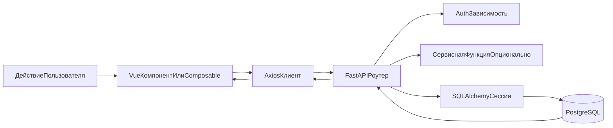

# Жизненный цикл запроса

Эта страница описывает стандартный путь выполнения API-запроса: от действия на frontend до изменений в базе данных.

## Высокоуровневый поток

## Шаги выполнения

1. Компонент или composable на frontend вызывает Axios-клиент.
2. Axios добавляет Bearer access-токен из Pinia-store.
3. FastAPI-роутер получает запрос и валидирует body/query/path через Pydantic и типизацию.
4. Зависимость `CurrentUser` декодирует JWT и загружает пользователя из БД для защищенных маршрутов.
5. Роутер выполняет доменное поведение:
   - прямые операции через ORM, и/или
   - вызовы сервисного слоя (notifications/calendar/streak).
6. SQLAlchemy-сессия коммитит транзакцию и сериализует response-схему.
7. Axios возвращает ответ; при 401 выполняется одна попытка refresh и повтор запроса.

## Асинхронные границы

- Middleware FastAPI асинхронный, но обработчики в основном синхронные.
- Фоновая отправка email использует FastAPI `BackgroundTasks`.
- Цикл напоминаний на frontend работает на браузерном таймере (`setInterval`).

См. также:
- [Поток auth и OAuth](./auth_and_oauth.md)
- [Поток напоминаний](./reminders.md)
- [Обзор API](../api/overview.md)
